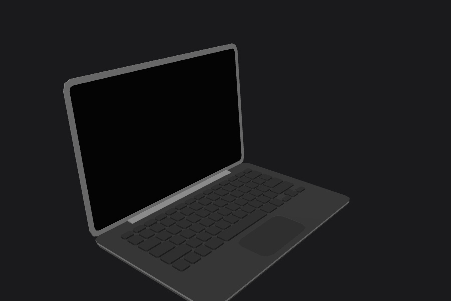
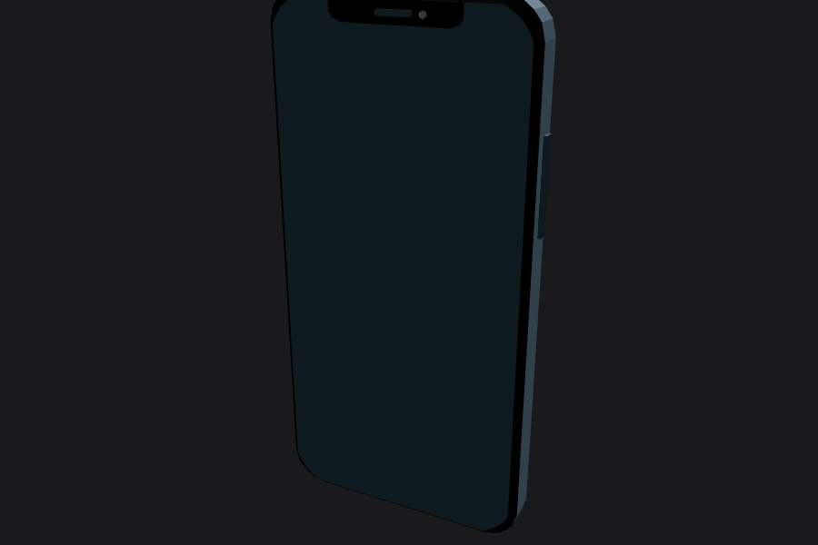
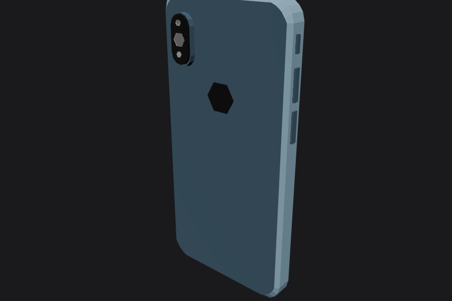
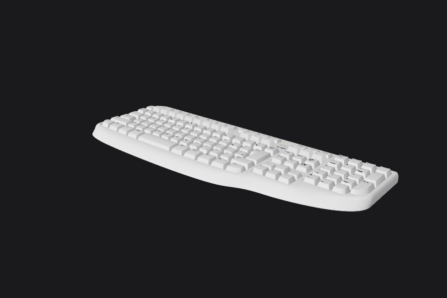
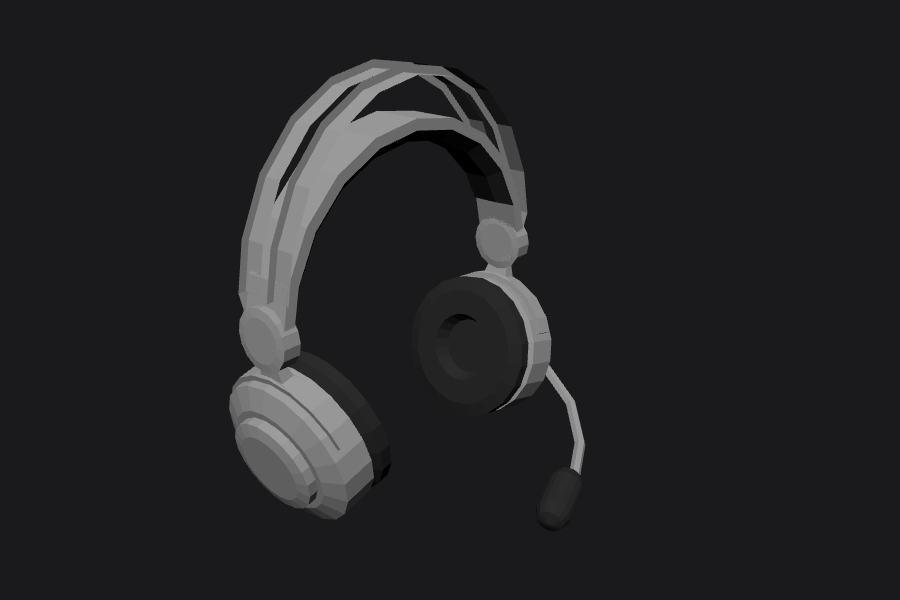
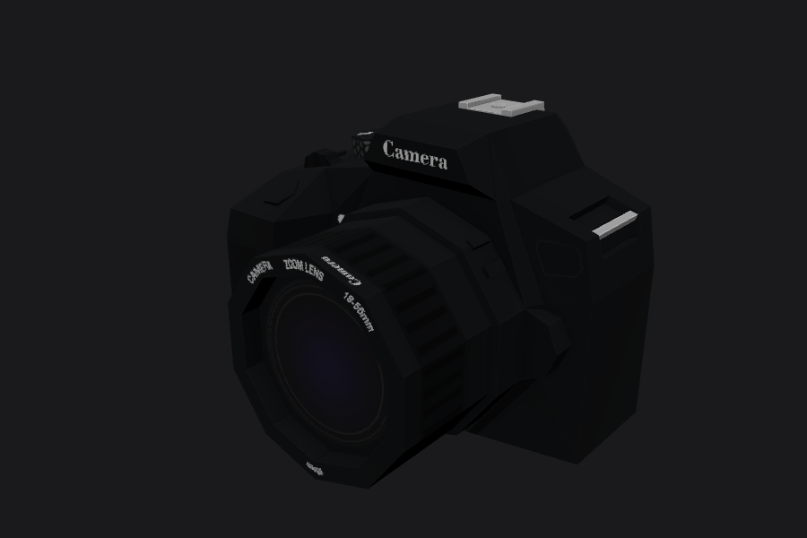

# Supplied GLB models: inspection report (Phase 3)

Five models received and saved to `assets-incoming/models/`.

Each one was checked three ways:
- JSON/buffer inspection (geometry, materials, textures)
- Headless three.js renders from two angles (`docs/glb-renders/`)
- A trial optimisation pass, to measure real savings:
  `gltf-transform optimize --compress meshopt --texture-compress webp --texture-size 1024 --simplify-error 0.001`

## Summary

| Model | Verdict | Role in the site | Raw → optimised (trial) |
|---|---|---|---|
| **Laptop** (J-Toastie) | **Keep, modify** | Hero workspace prop; Finance Leads CRM screen; the "portal" into Projects | 132 KB → **27 KB** |
| **Phone** (Alex Safayan) | **Keep, modify** | Health Insurance AI Chatbot station | 80 KB → **13 KB** |
| **Keyboard** (Akira Ohmachi) | **Keep, heavy optimisation** | Keylogger Research: keyboard inside a glass containment case | **5.0 MB → 116 KB** |
| Headset (Poly by Google) | **Drop** (optional background prop) | No project or part of the story uses it | 40 KB → 13 KB |
| Camera (Poly by Google) | **Drop** | No photo/video work in the materials | 1.59 MB → 31 KB |

The three kept props come to about **160 KB** after optimisation, well under the §16 budget.

**Common trait:** all five are *low-poly, flat-colour "Poly"-style* assets (every one was converted by `obj2gltf`). They match each other, but they're much simpler than the planned "realistic sculpture" character. Rules that follow:
1. Replace every material with the site's three-material palette (dark brushed metal, black glass, and an emissive screen). None of the original colours survive.
2. Keep props at **mid-distance**. The one planned close-up (pushing into the laptop screen) ends on our own screen plane, not the model's geometry.
3. If the laptop's hard facets show in the hero frame, give it a 30-minute Blender pass: bevel modifier plus weighted normals. A remodel isn't needed.

---

## 1. Laptop: `laptop_J-Toastie_UGOWjMUC5U.glb`



| Property | Value |
|---|---|
| Geometry | 1 node, 1 mesh, **4 primitives**, 3,600 verts, **2,000 tris** |
| Materials | `DarkGray`, `lighterGray`, `Gray2`, `Screen`: flat colours, no textures |
| Textures | none |
| Size | 132 KB → 27 KB (meshopt) |
| Units / scale | ~1.0 × 0.94 × 1.39 units. Scale ×≈0.3 to a 30 cm laptop |
| Style | Clean, MacBook-like silhouette, no logo, separate keycaps, trackpad. Fits the brief well |
| WebGL suitability | Excellent |

**Modifications needed**
- **Split the lid from the base** in Blender. The mesh is currently one piece, and the Workspace → Projects beat needs the lid to open or tilt as the character reaches for it.
- **Replace the screen.** `Screen` UVs sit in a small atlas region (u 0.63–0.87, v 0.26–0.49), so a project image can't be mapped onto them. Delete that primitive and add our own 16:10 plane with 0–1 UVs. It will carry a `VideoTexture`/`CanvasTexture` of project UIs, with the orange-tinted glow as the only emissive element.
- Re-material to dark brushed aluminium (metalness 0.8, roughness 0.4) and matte black keycaps.
- Optional bevel + weighted-normal pass if the hero close-up shows facets.

## 2. Phone: `phone_Alex-Safayan_1L9oJAw6nY2.glb`

 

| Property | Value |
|---|---|
| Geometry | **27 nodes / 27 meshes / 32 primitives**, 1,342 verts, **728 tris** |
| Materials | 8 flat colours (steel-blue back `mat16`, near-black, **bright red `mat8`**, **blue `mat5`**, two translucent `BLEND` glass) |
| Textures | none |
| Size | 80 KB → 13 KB |
| Units / scale | 0.76 × 1.50 × 0.18. Scale ×≈0.1 |
| Style | Generic notched smartphone with a hexagon "logo" on the back. Low-poly but tidy |
| WebGL suitability | Good geometry, **bad draw-call structure** (32 primitives for 728 triangles) |

**Modifications needed**
- **Merge by material** to about 3 primitives. `gltf-transform` `join` + `flatten` already does most of this.
- Re-material the whole body to black glass and dark metal. Remove the red and blue accents and the hexagon logo.
- **Screen**: UVs are unusable (negative and overlapping ranges). Add our own screen plane as for the laptop. It will show the chatbot conversation UI.
- The two alpha-`BLEND` glass layers cause sorting cost. Replace them with one opaque glossy screen material.

## 3. Keyboard: `keyboard_Akira-Ohmachi_dM8MokabmkE.glb`




| Property | Value |
|---|---|
| Geometry | 10 nodes, 9 primitives, 119,935 verts, **64,585 tris**. Keycaps alone (`key.white`) are 53k tris / 3.8 MB of vertex data |
| Materials | 6: white/grey keycaps (textured legends), white body, black key bottoms, **yellow LED (`BLEND`, α 0.7)** |
| Textures | 3 PNGs: **4096×2048**, **4096×1024**, 4096×128 |
| Size | **5.0 MB** → **116 KB** in the trial (simplified to ~10k tris, textures 1024 WebP) |
| Units / scale | 7.66 × 0.40 × 2.83. Scale ×≈0.06 to a 45 cm keyboard |
| Style | Full-size ergonomic board, detailed legends. High-quality source |
| WebGL suitability | **Not as supplied.** Fine after optimisation |

**Modifications needed**
- Simplify to ≤ 8k tris. At `--simplify-error 0.001` it landed at ~10k with slight shading blotches on some keycaps (see the second render). Do the final pass in Blender (decimate + weighted normals) or retry at error 0.0005, then look at it at the real camera distance.
- Retint to **graphite keycaps with light legends** (the white doesn't fit the dark world).
- Turn the yellow LED into the **orange accent**: a single caps-lock-style light that pulses. It's a quiet "something is recording keystrokes" cue for the Keylogger Research station.
- Change the LED from `BLEND` to an opaque emissive to avoid a transparency pass.
- Place it inside a procedural glass containment case (see PLAN §6).

## 4. Headset: `headset_Poly-by-Google_a7h9oaV3xzV.glb`



| Property | Value |
|---|---|
| Geometry | 1 primitive, 1,193 verts, 2,244 tris. **No normals** (renders faceted) |
| Material | 1, with a 256² palette texture |
| Size | 40 KB → 13 KB |
| Units / scale | 46 × 75 × 67. Authored in cm-like units, scale ×≈0.0025 |
| Style | Gaming-headset silhouette with boom mic, visibly faceted |

**Verdict: Drop.** No project, experience or story beat needs it, and the boom-mic look pushes toward the "gaming" aesthetic the brief rules out. If you actually wear one while working and want the desk to feel lived-in, it can sit in the background at 13 KB after recomputing normals. Tell me.

## 5. Camera: `camera_Poly-by-Google_0nfSsetwy0Z.glb`



| Property | Value |
|---|---|
| Geometry | 1 primitive, 1,595 verts, 743 tris |
| Material | 1, with a **2048² texture (1.53 MB of the 1.59 MB file)** |
| Style | Low-poly DSLR with **fake "Camera" / "ZOOM LENS" branding baked into the texture** |

**Verdict: Drop.** Nothing in the supplied materials is photography or video work, and the baked fake-brand text looks cheap next to the premium look. If you do have creative/video work to show, a better camera model would be needed anyway.

---

## Licensing / attribution (action required)

The file names follow Poly Pizza's `Name by Author - id` convention. **Poly by Google** assets are CC-BY 3.0. The other three authors' licences **must be confirmed** on each model's page, since Poly Pizza hosts both CC0 and CC-BY. Every CC-BY asset gets a credit line in the site footer/credits page.

| Asset | Author | ID | Licence |
|---|---|---|---|
| Laptop | J-Toastie | UGOWjMUC5U | confirm |
| Phone | Alex Safayan | 1L9oJAw6nY2 | confirm |
| Keyboard | Akira Ohmachi | dM8MokabmkE | confirm |
| Headset | Poly by Google | a7h9oaV3xzV | CC-BY 3.0 (dropped) |
| Camera | Poly by Google | 0nfSsetwy0Z | CC-BY 3.0 (dropped) |

## Still missing from the asset list (PLAN §6)

- **Monitor** for the MBVV Workforce Portal station. Recommend a procedural slab + screen plane (no download needed).
- Concrete seat block, cube cluster, glass case, paper sheets: custom or procedural, as planned.
- The **character**: still needs the raw photographs.

## Reproduce the numbers

```bash
npx @gltf-transform/cli inspect assets-incoming/models/<file>.glb
npx @gltf-transform/cli optimize assets-incoming/models/<file>.glb out.glb \
  --compress meshopt --texture-compress webp --texture-size 1024 --simplify-error 0.001
```

Production will use KTX2 instead of WebP for textures (PLAN §16). WebP was used here only for a quick size comparison.
